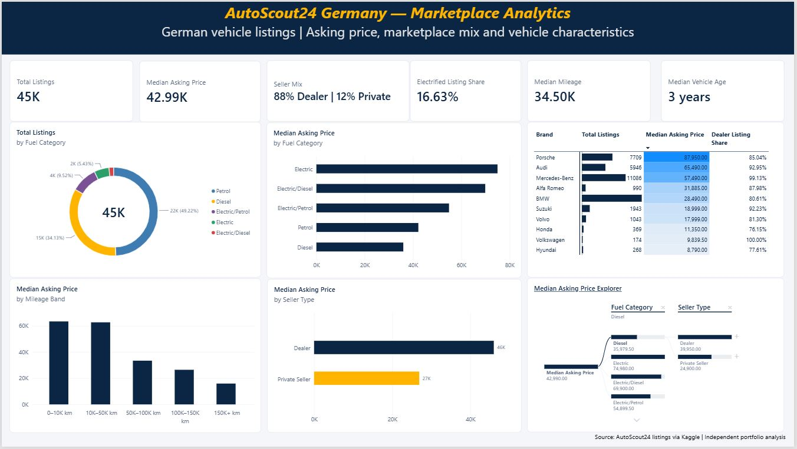
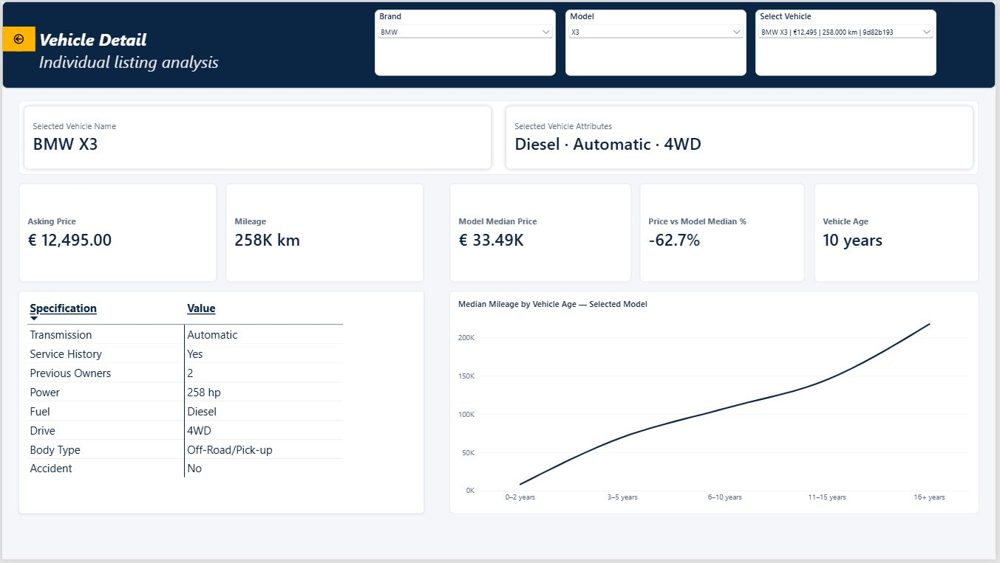
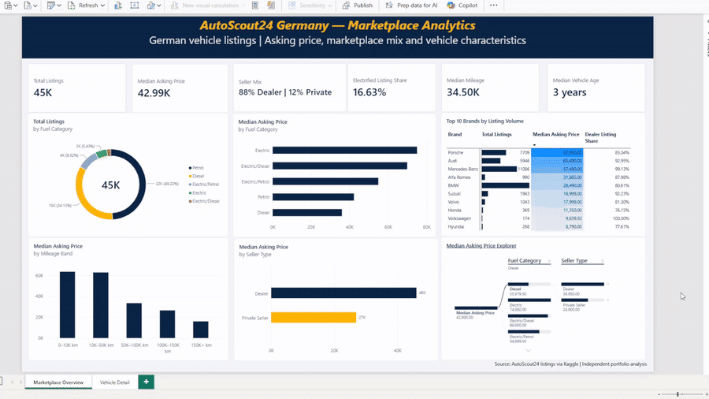

# AutoScout24 Germany — Marketplace Analytics

Power BI + SQL portfolio project analysing the **German online vehicle marketplace** through listing-level asking prices, marketplace composition, seller mix, and vehicle characteristics.

> **Source:** AutoScout24 listings via Kaggle | **Independent portfolio analysis**



## Project at a glance

This project explores a German marketplace snapshot containing **118,382 vehicle listings**. The analysis narrows the dataset to **45,485 German listings** with asking price >= €1,000.

The objective is not to estimate sales or customer demand. It is to use marketplace listing data to answer practical business questions around pricing, composition, vehicle characteristics, seller structure, and listing-level benchmarking.

## Business questions

1. What does the German vehicle marketplace look like?
2. How does asking price vary with vehicle characteristics?
3. Which brands and models have the highest listing volume, and how does the mix differ?
4. How is the marketplace composed across fuel technologies?
5. Where are potential value opportunities based on comparable listings?
6. How does the German marketplace differ between dealer and private-seller listings?

## Dashboard

### Marketplace Overview

The first page provides an executive-level view of the German listing population:

- total listings
- median asking price
- dealer/private seller mix
- electrified listing share
- median mileage
- median vehicle age
- fuel composition
- asking-price comparisons
- brand-level listing and pricing analysis
- seller-type analysis
- interactive **Median Asking Price Explorer** using a decomposition tree

### Vehicle Detail



The second page moves from marketplace-level analysis to an individual listing.

Users can select:

**Brand → Model → Vehicle**

and inspect:

- asking price
- model median asking price
- price vs. model median
- mileage
- vehicle age
- fuel
- transmission
- drive
- power
- body type
- previous owners
- accident/service-history indicators
- selected-model mileage by vehicle age

The model benchmark uses the **median asking price for the same brand + model** in the analytical population.



## Analytical approach

### Data preparation

**Power Query**
- type conversion
- vehicle-age calculation
- mileage bands
- age bands
- electrified classification
- presentation-oriented labels

**SQL / SQLite**
- German-market filtering
- seller comparisons
- fuel composition
- brand/model listing volume
- mileage analysis
- marketplace segmentation

**Power BI / DAX**
- KPI measures
- median benchmarks
- share measures
- interactive vehicle selectors
- decomposition-tree analysis
- listing-level benchmark calculations

## Core analytical population

| Metric | Value |
|---|---:|
| Raw dataset rows | 118,382 |
| German listings before price filter | 45,611 |
| Analytical German listings | 45,485 |
| Median asking price | €42,990 |
| Dealer listing share | 88.46% |
| Private-seller listing share | 11.54% |
| Electrified listing share | 16.62% |
| Median mileage | 34,500 km |
| Median vehicle age | 3 years |

## Selected observations

### Marketplace structure

Dealer listings make up the large majority of the German analytical population, while private-seller listings represent a smaller segment.

### Fuel composition

The listing population is predominantly **Petrol** and **Diesel**, with electrified categories forming a meaningful but smaller share of the snapshot.

### Mileage and asking price

The dashboard shows a descriptive relationship between mileage bands and asking-price levels: lower-mileage listings generally sit at higher asking-price levels than higher-mileage listings.

### Vehicle benchmarking

The Vehicle Detail page allows an individual listing to be compared with the median asking price for its brand + model. This turns the dashboard into a more decision-oriented analytical tool rather than a static marketplace report.

## Important interpretation notes

- The dataset contains **listings**, not completed transactions.
- Asking price is not the same as realised selling price.
- The data is treated as a marketplace snapshot; it is **not used as a reliable time series**.
- The fuel analysis describes marketplace composition, not historical market-share change or customer preference.
- The brand/model benchmark is descriptive and does not constitute a vehicle appraisal or objective undervaluation model.
- Some source attributes contain missing or inconsistent values.

## Repository structure

```text
autoscout24-germany-marketplace-analytics/
│
├── README.md
├── screenshots/
│   ├── marketplace-overview.jpg
│   └── vehicle-detail.jpg
│
├── media/
│   └── portfolio-walkthrough.gif
│
├── sql/
│   └── market_analysis.sql
│
├── dax/
│   └── measures.md
│
├── methodology/
│   └── methodology.md
│
└── findings/
    └── key-findings.md
```

## Tools

**Power BI Desktop · DAX · Power Query · SQL (SQLite) · Python/pandas**

## Dataset

[AutoScout24 Car Listings Dataset — 2025 Snapshot](https://www.kaggle.com/datasets/clkmuhammed/autoscout24-car-listings-dataset)

The raw dataset is **not included** in this public repository.

## Author

**Gazali Warsi**  
MSc Management & IT | Business & Data Analytics

This repository is part of my portfolio for Business Analyst, Data Analyst, Reporting Analyst, Operations Analyst, and Process/Digitalisation roles.
